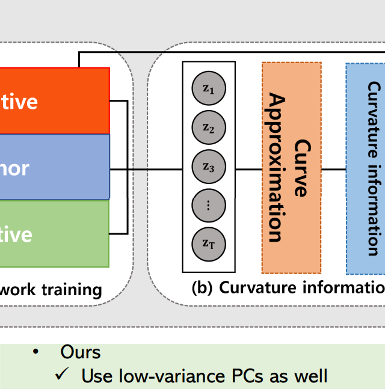

# CEAT: Curvature feature Extractor using Action based Triplet learning for Action Segmentation

/workspace/_action_seg/workspace/action_segmentation
assests 스펠링 틀림 !
<p align="left"></p>

This repository provides the official PyTorch implementation of the following paper:
> **Abstract:** *With the continued growth of untrimmed videos on the internet, there is an increasing demand for advanced action segmentation methods, capable of accurately and semantically localizing sequences within lengthy videos. Traditional approaches have attempted to overcome the prevalent issue of over-segmentation by smoothing the predictions of consecutive frames. However, this technique can potentially overlook important spatio-temporal characteristics. Other common strategies include the incorporation of supplementary temporal data, which can be difficult to obtain in practical real-world scenarios. To more effectively address these problems, we propose a novel approach that constructs a geometric curve
based on frame-wise embeddings and extracts curvature features. This procedure allows us to leverage the curvature information of embedded vectors and seamlessly integrate spatio-temporal information into existing action segmentation models. Our investigation reveals that our novel curvature-based approach enriches embedding representations, making them more suitable for action segmentation. It effectively brings closely together the representations of similar actions from different videos while appropriately distancing dissimilar action frames from the same video. Consequently, our experimental results provide substantial evidence that incorporating curvature information into various existing action segmentation models can significantly enhance action segmentation performances.*

### Requirement
```shell
pip3 install -r requirements.txt
```

### Train
```shell
bash ./scripts/run.sh
```

### Dataset
#### SWAT
We use the [SWaT](https://itrust.sutd.edu.sg/itrust-labs_datasets/dataset_info/) dataset.

### Citation
```
@article{jang2023ceat,
  title={CEAT: Curvature feature Extractor using Action based Triplet learning for Action Segmentation},
  author={Jang, Seungmin and Moon, Jeong-Hyeon and Kim, So Yeon and Sohn, Kyung-Ah},
  journal={IEEE Access},
  year={2023},
  publisher={IEEE}
}
```
